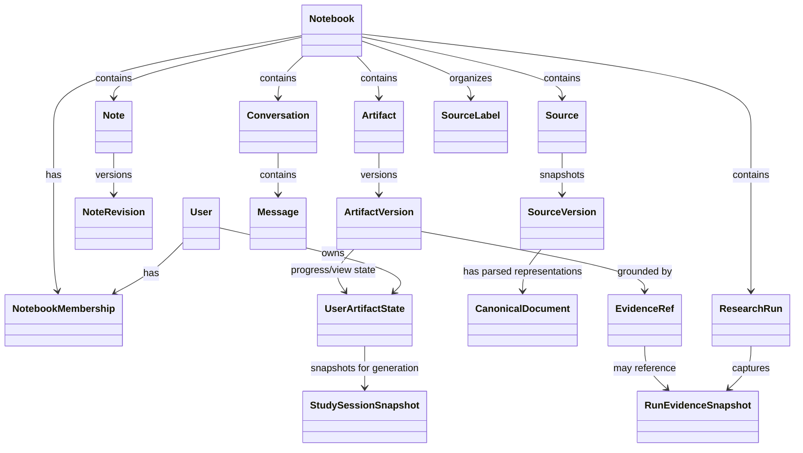

# 05 — Domain Model

## 1. Root object graph

## 2. User

Represents an authenticated human. A user MAY have personal provider credentials, UI preferences (including output-language and appearance defaults) and default model-role choices, subject to installation and notebook policy.

## 3. NotebookMembership

A membership links one user to one notebook with a role such as `owner`, `editor` or `viewer`. This is the baseline collaboration boundary; there is no separate organization/workspace object.

## 4. Notebook

The notebook is the primary product container. It owns references to sources, conversations, notes, artifacts and research runs. It MUST NOT encode a particular LLM or embedding model as part of identity.

Recommended fields include:

- id, title, description, icon/emoji metadata;
- notebook memberships, including at least one authoritative `owner` membership (an optional denormalized owner pointer MUST NOT be the authorization source of truth);
- notebook-wide custom instructions;
- created/updated timestamps;
- default selected-source behavior;
- source organization settings;
- model-role overrides;
- privacy/provider policy override if permitted;
- sharing state;
- version/activity metadata.

## 5. Source and SourceVersion

`Source` is the logical source. `SourceVersion` is an immutable snapshot or imported state while its payload is retained. This distinction allows refreshable web/connector sources without losing reproducibility. An explicit hard/privacy purge may remove the retained payload and leave only a tombstone/identifier sufficient to report that historical evidence was purged; purge is the deliberate exception to payload reproducibility, not mutation into different source content.

A source contains type, origin, local display title, connector metadata, current-version pointer, availability state and optional access/restriction policy. Editing the local display title is a metadata change on logical `Source`; it does not rewrite original bytes, upstream identity, `SourceVersion` content or historical manifests. A retained `SourceVersion` may have multiple immutable `CanonicalDocument` representations over its lifetime when parser/canonical-schema upgrades require reprocessing; one representation is active for new retrieval, while older representations remain only as long as retained evidence/manifests require them. Availability should distinguish at least active, stale/refresh-failed, inaccessible/revoked, and deleted/tombstoned states. A source version references original bytes/content and a canonical document. Restricted connector sources MAY attach per-user access checks and downstream reuse/export restrictions without contaminating the canonical content representation itself. Losing connector access MUST make the source ineligible for new retrieval/generation without silently deleting historical version metadata.

## 6. Conversation and Message

A conversation is independent of notebook identity and has an explicit owning user/principal and visibility policy. **Notebook membership does not imply access to another user's chat history.** The parity default is user-private conversation history even inside a shared notebook; deliberately shared/published conversation views, if supported, are separate resources/policies. Messages are immutable once committed except for explicit privacy deletion/redaction/tombstoning and retain the exact pinned `GenerationInputManifest`, selected-source/note references, chat mode (ordinary/agentic), model metadata, external/local provider status, tool/retrieval trace references and citations so past answers remain explainable even after notebook contents or settings change. Serving citation excerpts later still requires current authorization and source-restriction checks; historical metadata must not become a bypass around revoked access. Starting/resetting to a new conversation does not mutate the old conversation. Explicit **delete chat history**, however, is a privacy deletion: it removes the user's private conversation messages plus content-bearing conversation-context snapshots/caches that exist solely to reproduce those messages. Non-content audit/tombstone metadata may remain. The system must not secretly preserve deleted chat content merely for reproducibility.

## 7. Note and NoteRevision

`Note` is the stable collaborative object; `NoteRevision` is an immutable snapshot of its content. Notes may be human-created, saved from chat, or derived from sources. `Note` SHOULD carry a kind/editability policy: user-authored notes are editable, while a parity-compatible saved-chat-response note may be immutable/non-editable after creation even though it still has a revision/provenance identity. Realtime collaborative editing MAY use CRDT/OT or another mutable working representation, but any note selected as generation context MUST resolve to an immutable `NoteRevision` before the operation begins. This prevents a collaborator editing a note halfway through a long response from silently changing the operation's inputs.

A note revision SHOULD preserve rich structure (for example tables and inline citations), author/editor metadata, provenance/evidence references and any attachments. System-generated/source-derived note content MUST retain its exact content dependencies so access/reuse restrictions and AD-016 purge traversal remain enforceable; known-derived note revisions may therefore be invalidated/purged by a source privacy purge. Notes MAY themselves become notebook sources if explicitly promoted/imported, at which point a normal immutable `SourceVersion` is created rather than making the mutable note masquerade as a source.

Notes MUST NOT silently join the ordinary source corpus. When a user explicitly selects a note for a prompt or note-transformation operation, the request pins the exact `NoteRevision` in its input manifest. This preserves the reference behavior that notes are optional prompt context while keeping ordinary source retrieval deterministic.

Parity note transformations include combining selected notes, constructive critique, concise summary, outline, study-guide generation, related-idea suggestions and converting one or all notes to normal sources. These are explicit user actions that create a new `NoteRevision`, `Note`, `SourceVersion` or export as appropriate; they do not mutate source material or silently add notes to retrieval.

## 8. Artifact and ArtifactVersion

`Artifact` is the stable logical object; `ArtifactVersion` is immutable generated/revised content. Versions store recipe version, prompts/instructions, the exact pinned `GenerationInputManifest`, evidence/content dependencies, model/provider metadata, structured representation and rendered outputs. Those dependencies are also the basis for AD-023 effective access/reuse checks and AD-016 purge traversal. Composite artifacts MAY reference exact versions of other artifacts; those dependencies are version-pinned so an embedded artifact changing later cannot silently alter an older report. An artifact may be marked **out-of-date relative to current sources** after a refresh, but the historical artifact version remains bound to the source versions from which it was generated.

### 8.1 UserArtifactState / study progress

Mutable user-specific interaction state MUST be separate from immutable/shared artifact content. For flashcards/quizzes this includes per-user current position, got-it/missed-it answers, scores, retry sets and completion timestamps. The same pattern MAY hold per-user playback/view state. One collaborator's study actions MUST NOT mutate another collaborator's progress or create a new artifact version.

When a user explicitly asks chat to analyze their completed quiz/flashcard performance, the operation MUST materialize an immutable, user-private `StudySessionSnapshot` from the relevant `UserArtifactState` plus exact `ArtifactVersion`. The snapshot contains only the progress/answers/results needed for that request, is pinned in the generation input, and remains subject to the user's current notebook/artifact access. Mutable study state never enters another user's context or the notebook-wide source index.

## 9. GenerationInputManifest

Every committed model-generated output MUST be associated with an immutable `GenerationInputManifest` describing the exact inputs to that generation step. For static-input operations such as ordinary chat or a Studio generation, the manifest is resolved before generation starts. Agentic/research runs additionally keep an immutable **initial run snapshot** plus an append-only tool/evidence ledger because future web/tool results do not exist at run start; each planning/synthesis/final generation step materializes its own manifest from the exact notebook inputs and tool-result/evidence snapshots available to that step. A final research report/agentic answer therefore never cites an unversioned mutable run state. The manifest records:

- the exact authorized and selected `SourceVersion` ids plus the resolved immutable `CanonicalDocument` representation ids used for retrieval/citation;
- explicitly selected `NoteRevision` ids;
- any input `ArtifactVersion` ids;
- any explicitly selected immutable `StudySessionSnapshot` used for study-performance follow-up;
- for conversational operations, the exact prior `Message` ids/content hashes included as conversation context (or an immutable equivalent context snapshot);
- a resolved generation-configuration snapshot (notebook custom instructions as actually applied, user/request instructions, chat style/mode, output language and material feature flags);
- retrieval/context-builder version and relevant retrieval settings, including the resolved index/embedding generation(s) used by the operation;
- prompt/system-template or artifact-recipe version;
- requested model roles/provider constraints, with the actual routed provider/model recorded on the resulting operation/output.

Once a manifest is materialized, retrieval/index updates, note edits, artifact revisions, notebook-instruction changes, preference changes, conversation-history changes/resets, connector refreshes or later agent tool results MUST NOT silently change it. A later agent generation may deliberately create a new child manifest that references newly acquired immutable tool/evidence results.

The manifest is not an authorization bypass: replaying or viewing historical evidence still requires current permission and connector-restriction checks. Its purpose is consistency and reproducibility, not permanent access.

## 10. ResearchRun

A research run records its initiating user/principal and notebook, visibility policy, goal, plan, searches, fetched sources, evaluations, generated report, candidate imports, tool calls, cost/usage and final status. Research/Agentic Chat traces are private to the initiating user by default; imported sources, explicitly saved notes and committed artifacts become notebook-shared only through the corresponding authorized domain operation.

## 10.1 RunEvidenceSnapshot

`RunEvidenceSnapshot` is an immutable, run-scoped capture of external/tool evidence that has not been imported as a notebook `Source`. Typical examples are a fetched webpage revision or an execution result. It records origin/tool, acquisition time, final URL or other origin locator where applicable, content hash/storage reference, canonical/excerpt locators and applicable access/reuse metadata. Search-result snippets alone SHOULD NOT be treated as authoritative evidence when the underlying result can be fetched and captured.

Run evidence is private to the initiating run/user by default. It may be promoted to a normal `SourceVersion`, or retained as an explicit dependency of a committed artifact/answer. If a shared artifact exposes or contains run evidence, that evidence must have a defined authorized retention/share policy sufficient for the citation/content to resolve under AD-023; otherwise the evidence must be promoted/imported or the output must not advertise/expose a durable dereferenceable citation. `RunEvidenceSnapshot` is content-bearing and participates in AD-016 purge closure when its content derives from a purged source or retained dependency.

## 11. Separation invariants

The following are deliberately distinct:

- Notebook != Conversation
- Notebook != model session
- Source != SourceVersion
- Note != NoteRevision
- SourceVersion != chunk/index
- Artifact != rendered file
- Provider != Model
- Model != ModelRole
- Evidence != Citation presentation

These distinctions are critical for replacement, versioning and reproducibility.
