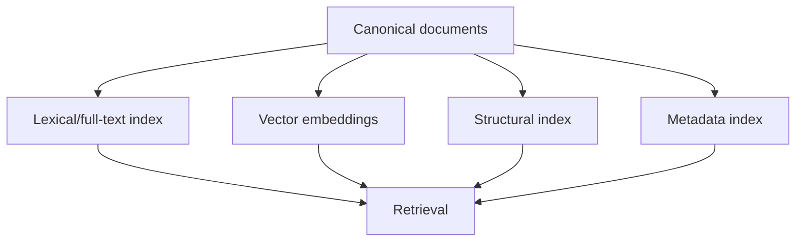

# 08 — Knowledge Storage and Indexing

## 1. Principle

The knowledge layer is a set of derived indexes over canonical source data, not the source of truth itself.

## 2. Representations

## 3. Chunking

Chunking must be structure-aware. The system SHOULD support multiple chunking strategies and versions. Chunk metadata includes source node references, section hierarchy, token length, overlap and chunker version.

Potential strategies:

- paragraph/section chunks;
- sliding token windows;
- table-aware chunks;
- transcript time windows;
- semantic boundary splitting;
- parent/child hierarchical chunks.

## 4. Lexical retrieval

Lexical/full-text retrieval remains valuable for names, identifiers, exact phrases and rare terms and is a mandatory capability. The reference implementation MAY use PostgreSQL `tsvector`/`tsquery` ranking (`ts_rank`/`ts_rank_cd`) initially. Native PostgreSQL FTS MUST NOT be mislabeled as BM25. BM25 or another lexical ranker MAY replace or augment the baseline behind the retrieval interface when evaluation demonstrates a meaningful retrieval-quality benefit; this does not require changing the notebook/domain model.

## 5. Semantic retrieval

Embeddings are stored with model/version metadata. The system MUST support re-embedding without mutating canonical data. Multiple active embedding spaces MAY coexist during migration or evaluation.

### 5.1 Multimodal evidence

Images, figures, charts and slide visuals should remain retrievable evidence rather than being reduced only to generated captions. Implementations MAY combine OCR text, model-generated descriptions, image/vision embeddings and structural proximity to surrounding text. Any model-derived description must remain distinguishable from the source visual itself.

## 6. Metadata filters

Retrieval MUST be able to filter by notebook, selected sources, source label, content type, date/version, language and permission visibility.

## 7. Structural retrieval

The system SHOULD support navigating document hierarchy: retrieve a matching passage, then its parent section, neighboring paragraphs, table context, slide context or transcript window.

## 8. Initial storage direction

Per AD-017, the reference implementation uses PostgreSQL for transactions, PostgreSQL full-text search and `pgvector`. Original/large blobs are accessed through the object-storage abstraction with a local-filesystem backend by default; an S3-compatible backend is optional. The architecture MUST allow later migration to dedicated vector/search systems without changing domain objects.

## 9. Index lifecycle

Indexes have explicit states: absent, building, ready, stale, failed. Each ready index/embedding build has an immutable generation/version identifier. Changes in embedding model, chunker or canonical representation invalidate only relevant derived layers; a newly built generation becomes active atomically. An old physical index generation must remain available while an in-flight operation has pinned it, but may be garbage-collected after no active operation needs it; historical operation records retain the generation/model/configuration metadata even when the rebuildable physical index has been removed.

## 10. Note-context indexing semantics

Notebook notes are not silently merged into the ordinary source corpus. When a user explicitly selects notes as prompt context, pinned `NoteRevision` content SHOULD normally be injected directly into context; a separate authorization-scoped note index is only justified if note volume makes direct inclusion impractical. Converting a note to a source creates a normal `SourceVersion` and enters the standard source indexing pipeline.
