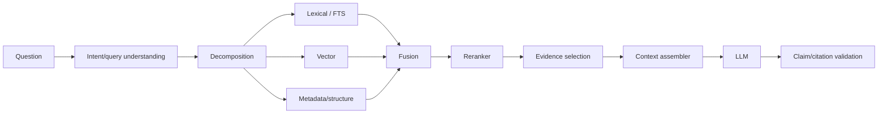

# 09 — Retrieval, Grounding and Citations

## 1. Purpose

The retrieval/grounding subsystem turns a user or agent request into a compact, relevant, attributable evidence bundle suitable for a selected model.

## 2. Query pipeline

## 3. Query understanding

The system SHOULD distinguish tasks such as direct lookup, cross-source comparison, synthesis, chronology, aggregation, contradiction search and multi-hop questions. Complex queries may be decomposed into subqueries.

## 4. Fusion and reranking

Candidate retrieval SHOULD combine lexical and semantic results. The lexical adapter may use PostgreSQL full-text ranking in the reference deployment or BM25/another lexical ranker if later evaluation justifies it; fusion must not depend on one specific lexical scoring formula. Authorization/source-access filters MUST be applied before evidence is exposed to the model/user, with a final post-retrieval authorization check as defense in depth; vector/search index membership must never be treated as authorization. A reranker MAY be a dedicated cross-encoder, LLM, heuristic, or provider-neutral role. Reranking is separately benchmarked.

## 5. Context assembly

The context builder is model-aware. It operates against the request/job's pinned `GenerationInputManifest` (exact `SourceVersion` + `CanonicalDocument` representation, explicitly selected `NoteRevision`, any `ArtifactVersion` inputs, any explicit user-private `StudySessionSnapshot`, and resolved retrieval/index generation), receives the chosen model's context capacity and capabilities, and selects an appropriate strategy:

- compact top evidence for smaller local models;
- hierarchical summary + evidence;
- larger direct source excerpts for long-context models;
- multi-pass retrieval for complex synthesis;
- source-selection constraints from the UI.

## 6. Grounded answer contract

Grounded chat should produce a structured result containing:

- answer text or streaming events;
- claim/evidence associations where feasible;
- citations resolved to canonical source locations;
- model/provider usage metadata;
- retrieval trace identifier;
- warnings when evidence is insufficient or contradictory.

## 7. Source-only behavior

The normal Notebook chat path MUST treat the selected notebook sources as its factual grounding set and MUST NOT silently invoke web/tools. If the user explicitly selects notes as prompt context, exact selected `NoteRevision`s are added to that operation's pinned grounding set; other notes do not silently enter context. An explicit study-performance follow-up may additionally pin the requesting user's immutable `StudySessionSnapshot` plus its exact `ArtifactVersion`; study state is personal context, not source evidence, and must be labeled as such in the answer. Model background knowledge may be used for language/reasoning, but it must not silently introduce unsupported factual assertions. The parity-target **Agentic Chat** path MAY add web/tool evidence, but it must be visibly distinct and its external evidence must use the same provenance/citation contract.

## 8. Citation validation

Before finalization, citations SHOULD be checked for:

- cited span actually supporting the nearby claim;
- citation/evidence resolving to the exact pinned `SourceVersion` + canonical representation, `NoteRevision`, or immutable `RunEvidenceSnapshot` used for the answer/artifact, while separately enforcing the viewer's current authorization/source-access policy;
- no accidental citation to unrelated chunk context;
- correct source and location display;
- multimodal citations resolving to the correct image/figure/region when visual evidence is used.

For a source too short to support a useful span-level citation, validation MAY accept an explicit document/root-level citation. It must not fabricate offsets merely to satisfy a finer-grained UI contract.

A verifier model MAY help, but deterministic checks should be used where possible.

## 9. Contradictions

When sources disagree, the system SHOULD surface the disagreement and cite competing evidence rather than blending sources into a false consensus.

## 10. Evaluation

Retrieval and grounding metrics are defined in Chapter 18. Changes to chunking, embeddings or reranking should be tested against a stable corpus/query suite.
