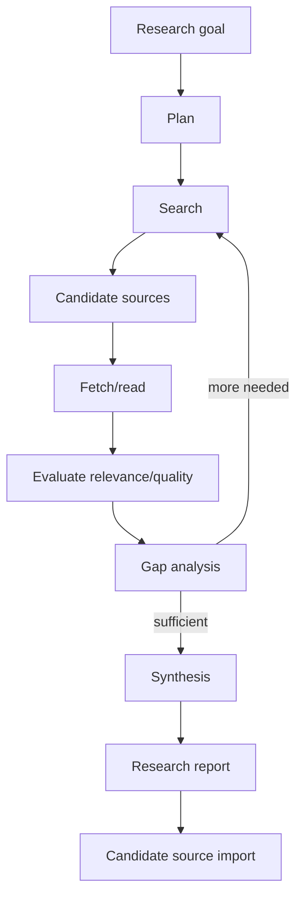

# 11 — Agent and Research Runtime

## 1. Purpose

The agent runtime performs multi-step work that cannot be represented as one retrieval + generation call. Deep Research is the primary parity use case.

## 2. Research lifecycle

## 3. Agent state

A research run records:

- initiating user/principal, notebook and trace visibility;
- user goal/instructions;
- plan and revisions;
- budget/limits;
- tool calls/results;
- searches and queries;
- candidate source evaluations;
- imported/snapshotted sources;
- intermediate notes;
- final report;
- citations/provenance;
- provider/model usage;
- timestamps and status.

Agent/research runs begin with an immutable snapshot of their initial notebook/configuration inputs. Tool results that influence later reasoning MUST be captured as immutable, provenance-bearing `RunEvidenceSnapshot` records (or references to immutable imported `SourceVersion`s) before they can enter a subsequent model generation. Each model planning/synthesis/final-answer step records its own `GenerationInputManifest`; the run itself remains an append-only orchestration history rather than one mutable prompt blob.

Run traces are private to the initiating user by default even inside a shared notebook. Notebook collaborators see imported sources, shared notes or artifacts only when the initiating user commits them through normal authorized domain operations; raw browser/tool/execution traces are not implicitly shared. When a committed shared output cites run evidence directly, only the minimal immutable evidence snapshot required to resolve that citation is shared under the output/source restriction policy—not the surrounding private agent trace. Administrators do not gain trace/content access merely by being installation administrators, subject to the same explicit audited break-glass rule as notebook content.

## 4. Tool registry

Initial tool families:

- notebook search;
- canonical source read;
- source metadata read;
- web search;
- connector/repository search;
- web fetch;
- browser/navigation when needed;
- source import;
- artifact create/update;
- structured data analysis;
- code execution through `ExecutionProvider`;

Tools expose schemas, permissions, side-effect level and timeout/budget metadata.

## 5. Research source quality

The agent SHOULD assess relevance, duplication, source authority, date, primary-versus-secondary status and contradictions. These assessments are annotations, not unquestioned truths.

## 6. User control

Research jobs must support cancellation. The UI SHOULD expose meaningful progress such as planning, searching, reading, synthesizing and candidate-source count rather than only an indeterminate spinner.

## 7. Fast research versus Deep Research

The architecture may offer two modes:

- **Fast source discovery:** one/few searches and ranked candidate sources;
- **Deep Research:** iterative planning, searching, reading, gap analysis and synthesis.

Both use the same tool layer but different orchestration recipes/budgets.

## 8. Browser automation

A headless browser MAY be needed for JavaScript-heavy pages. It is a controlled tool, not arbitrary browser access from model-generated code. The browser worker MUST run as a separate unprivileged service/process (preferably a distinct service identity) with an ephemeral profile by default and no application/provider secrets. Its default Internet-research network path MUST pass through an egress policy that blocks loopback, link-local, private and cloud-metadata destinations and revalidates redirects, DNS resolution changes and page subresources; an authenticated intranet/browser profile is an explicit administrator/user-authorized mode. Reuse of an authenticated browser session or cookie jar MUST be explicit and task-scoped; the agent must not silently inherit unrelated personal browser sessions. Browser/fetch results are untrusted source data: page text must never be allowed to redefine tool permissions, provider policy or authorization rules merely because it contains instructions addressed to the agent.

## 9. Relationship to chat

The application exposes two conceptually distinct paths:

- **ordinary notebook chat** — selected notebook sources plus explicitly selected, version-pinned notes, with no implicit web/tool expansion;
- **agentic chat** — an explicit tool-capable mode backed by this Agent Runtime.

Agentic chat MAY search/fetch the web, run research, call `ExecutionProvider`, analyze data, produce downloadable files/charts/images and revise generated outputs. Tool calls remain permission-checked and inspectable, and long-running research remains a first-class run/job with its own trace rather than disappearing into opaque chat state. Agentic mode MAY operate with or without selected notebook sources when policy permits.

A user MUST be able to cancel an in-flight tool/generation sequence. Resumption/continuation SHOULD preserve the trace rather than silently re-running already completed side effects.

Agent traces SHOULD expose plans/status, tool calls, tool results, citations and concise rationale/progress summaries needed for inspection. Provider-internal hidden chain-of-thought is neither required for parity nor a persistence/API contract; providers that expose special reasoning-detail UI may be normalized into safe summaries/trace events instead of storing raw private reasoning.
