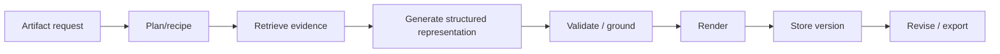

# 13 — Studio and Artifact Framework

## 1. Principle

Studio is implemented as one extensible artifact pipeline rather than independent hard-coded generators.

## 2. Generic lifecycle

## 3. Artifact data model

An artifact version records:

- artifact type and schema version;
- title and user instructions;
- exact per-generation input manifest (selected `SourceVersion` + canonical representations, explicitly selected `NoteRevision`s, any `ArtifactVersion`/`RunEvidenceSnapshot` dependencies, and resolved retrieval/index/configuration versions);
- recipe/template version;
- model/provider roles used;
- generation parameters;
- evidence references;
- structured intermediate representation;
- validation results;
- rendered files;
- parent version and revision metadata.

## 4. Initial artifact types

### Reports
Reports use one document family plus a generic composite substrate:

1. **Document reports** — FAQ, briefing document, study guide, blog/article-like formats, AI-suggested formats and custom report instructions. These are stable parity targets. Portable export SHOULD include Markdown/DOCX/PDF where renderers support them; tabular report content SHOULD additionally export to CSV/XLSX with citation/provenance material preserved in a companion sheet/file when it cannot be embedded naturally.
2. **Interactive/composite report substrate** — structured content that can embed or invoke other Studio artifacts. The substrate is retained because it is broadly useful and supports the newly announced Interactive Learning Overview without introducing a feature-specific architecture. Embedded children MUST reference exact `ArtifactVersion` dependencies rather than a mutable logical artifact pointer; revising/deleting a child must not silently mutate an already-generated parent report. Refreshing/replacing a child creates a new report version or an explicit dependency update.

**Interactive Learning Overview** is a stable Phase 4 parity recipe over the composite-report substrate. It provides an interactive textual overview plus suggested or embedded Studio learning artifacts such as infographics, quizzes or flashcards. The exact visual layout and child set remain implementation choices, but dependency versioning, authorization and source grounding follow the common artifact contract.

### Data tables
Structured extraction, calculations and citations with output-language and custom row/column/schema instructions. Export SHOULD support CSV/XLSX-compatible forms and preserve citation/provenance information in an adjacent sheet/file when the target format cannot embed it naturally.

### Mind maps
Node/edge representation with evidence-linked concepts. Rendering is separate from graph content. The viewer SHOULD support zoom/pan, branch expand/collapse, node selection that seeds a grounded chat question, download/export and good/bad feedback.

### Flashcards
Question/prompt, answer, explanation, source references and tags. **Study progress is mutable per-user state separate from the shared immutable artifact version.** Stable parity controls include previous/next and full-screen navigation, difficulty, requested quantity, explain, shuffle, got-it/missed-it progress, targeted retry, card deletion, session restart and CSV-compatible export. Session restart/progress are per-user state. Deleting, adding or editing a card in shared content creates a new immutable `ArtifactVersion` (a UI MAY additionally offer a purely personal hide/skip state without changing the shared deck). Add/edit-question customization and chat follow-up over a user's performance are announcement-level behavior; the schema and `StudySessionSnapshot` support them without making them stable release gates.

### Quizzes
Question structures, answers, distractors where applicable, explanation, difficulty and citations. Scores/current position/results are **per-user study state**, not shared artifact content. Stable parity controls include previous/next and full-screen navigation, requested quantity, hints, explain/review, persisted results and retry. The schema SHOULD allow additional question types without requiring a domain-model migration. Short answer, multiple select and fill-in-the-blank plus add/edit-question customization are officially announced but remain provisional until stable help documentation confirms shipped behavior. Explicit performance follow-up in chat uses a private immutable `StudySessionSnapshot`; it never exposes another collaborator's answers or turns mutable study state into shared source content.

### Slide decks
Structured deck -> slides -> elements. Support detailed and presenter-oriented modes, short/default/long length, per-slide revision, slide deletion/restoration, drag/drop slide reordering, slideshow viewing, zoom, feedback, citations and export/render to PDF/PPTX where possible. Each applied revision creates a new immutable deck version. The reference product currently warns that its slide-revision pass does not consult sources; this project deliberately keeps the exact parent deck/evidence manifest available to revision recipes and SHOULD re-ground factual revisions instead of copying that limitation.

### Infographics
Structured narrative/layout plan plus generated or source visuals and citation metadata. Parity controls include language, detail level, square/portrait/landscape orientation, predefined or auto-selected visual style plus custom-prompt steering, zoomable viewing, PNG-compatible export and share links.

### Audio Overview
Dialogue/script plan, speaker configuration, evidence map, generated audio segments and final composition. Parity recipes include Deep Dive, Brief, Critique and Debate formats plus language/length/steering controls; interactive participation is provided by the realtime subsystem.

### Video Overview
Storyboard, narration, visual assets, timings, citations and final render. Parity recipes include Explainer, Short and Cinematic formats plus language, visual-style/custom-style and steering controls where supported by the selected provider pipeline.

## 5. Recipe system

Each artifact type is driven by a versioned recipe describing stages, required capabilities, validation rules and renderer. Recipes MAY be configurable without changing application code. Recipes inherit the user output-language default unless the request explicitly overrides it and the selected capability supports that language.

## 6. Revision

Revision should target structured elements. Examples:

- regenerate one slide;
- change quiz difficulty;
- shorten an audio section;
- replace one infographic block;
- update a report section after source changes.

A revision creates a new immutable artifact version. When a source or selected note advances to a newer version, existing artifacts remain reproducible against their original input manifest and SHOULD be marked stale/out-of-date when the user is likely to expect regeneration. Artifact viewers SHOULD expose the generation instructions/custom prompt used for that version (matching the reference product's “View/Show prompt” behavior where applicable), support stable share links where policy allows, and provide type-appropriate downloads/exports. Feedback (for example good/bad output) MAY be stored in a separate mutable/user-attributed feedback record keyed to the immutable artifact version and used by the evaluation system; feedback MUST NOT mutate historical `ArtifactVersion` content.

An export is an immutable detached rendition of one exact `ArtifactVersion` or note/source snapshot. It does not become a synchronized alternate editor, and later application revisions do not rewrite already downloaded/external files. Authorization and AD-023 restrictions are evaluated before export; application permissions cannot revoke an independent copy after it leaves system control.

## 7. Extension boundary

Artifact recipes and schemas MUST have clean internal interfaces so new artifact types can be added later, but a user/admin-facing custom-artifact framework or plugin SDK is **not** a baseline requirement. The parity roadmap should implement the documented Studio types first.
