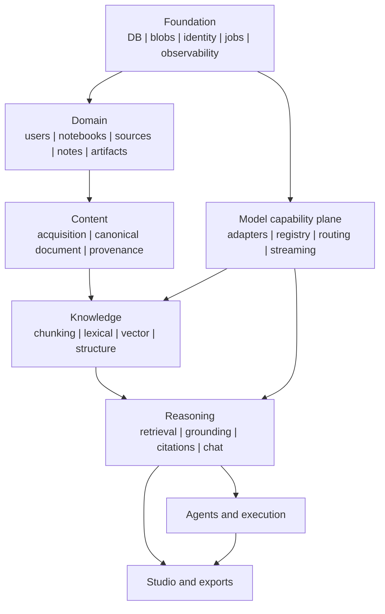

# 22 — Dependency Graph and Implementation Phases

## 1. Architectural dependency hierarchy

Identity/policy, jobs, observability and the responsive web client are cross-cutting rather than a final layer. Collaboration begins with membership/authorization in the foundation/domain phases; later phases add copy/publication polish. This DAG avoids the false implication that embeddings can be built before the model-capability plane they depend on. External ecosystem integrations and plugin SDK work remain beyond the parity roadmap. The arrows are build/runtime dependencies, not strict release gates.

### 1.1 Reference-deployment dependency inventory

The architecture distinguishes **hard runtime dependencies** from **feature-gated capability dependencies** so optional parity work does not make the whole installation fragile.

| Dependency/capability | Baseline status | What depends on it |
|---|---|---|
| GNU/Linux kernel/userspace with required namespace + cgroup support | Required server platform | Services; Bubblewrap execution |
| PostgreSQL | Required reference deployment | Domain state, jobs/leases, FTS, metadata |
| `pgvector` extension | Required for the reference semantic index once vector retrieval is enabled | Embedding/vector retrieval |
| Service-owned blob storage (local filesystem by default) | Required | Original uploads, extracted assets, rendered media/artifacts |
| At least one text-generation model provider | Required for AI functionality | Chat, generation, research planning |
| Embedding model/provider | Required for baseline hybrid semantic retrieval; lexical-only degraded mode MAY remain available | Vector indexing/retrieval |
| Bubblewrap >= patched baseline plus execution broker/runtime | Feature dependency | Agentic code/data analysis only |
| Web search/fetch capability | Feature dependency | Source discovery, Fast/Deep Research, Agentic Chat web use |
| Headless browser engine | Optional feature dependency | JavaScript-heavy research/browser tool only |
| OCR engine/model | Feature dependency | Scanned/image-heavy source enrichment |
| STT capability | Feature dependency | Audio source ingestion; composable realtime voice |
| TTS capability | Feature dependency | Audio Overview; composable realtime voice; narrated video |
| Image/media generation capability | Optional feature dependency | Infographics/visual assets when source assets are insufficient |
| Video-generation provider | Optional advanced dependency | Cinematic/high-generation video paths only |
| Media compositor/transcoder (for example FFmpeg-equivalent) | Feature dependency | Audio/video rendering |
| Document/slide render/export libraries | Feature dependency | PDF/DOCX/PPTX/XLSX and related exports |
| Reverse proxy/TLS terminator | Recommended deployment dependency, not architecturally mandatory if the app is otherwise terminated securely | HTTPS, compression, ingress policy |

A missing feature dependency MUST degrade only the capability that requires it. For example, an installation with no TTS can still ingest PDFs and use grounded chat; an unavailable external provider must not make local-provider routes unavailable. Concrete parser/render/model libraries remain implementation selections and are not frozen by this table.

## 2. Phase 0 — Skeleton and architecture harness

Deliver:

- repository/module boundaries;
- configuration system;
- DB migrations;
- object storage abstraction;
- auth/user/notebook-membership/notebook skeleton;
- job/orchestration interfaces;
- tracing/logging base;
- provider registry interfaces;
- the Chapter 25 requirements/test traceability ledger and test-case schema;
- deterministic entity factories plus fake model/embedding/connector services;
- fake synchronous/asynchronous speech/image/video providers with polling/callback/failure behavior;
- disposable production-schema persistence fixtures; and
- the real-browser E2E harness and shared manual-test seed command.

## 3. Phase 1 — Source-to-grounded-chat vertical slice

Deliver one complete path:

- PDF/text upload;
- canonical document with page/structure provenance;
- chunking + lexical/vector search;
- the provider-neutral model gateway exercised against at least one local provider and one external OpenAI-compatible provider when available (Big Pickle MAY be used for the external test while it remains available, but is never required);
- grounded chat + notebook custom instructions;
- immutable generation-input manifest per request/job;
- user output-language and appearance preferences;
- precise text/image source citations/source viewer + basic Source Guide;
- minimal evaluation harness.

This phase validates the foundational architecture before adding breadth.

## 4. Phase 2 — Universal ingestion and robust retrieval

Add the remaining high-value document/media/web formats, OCR/STT/vision enrichment, source labels, Source Guide enrichment, multimodal evidence retrieval, hybrid retrieval, reranking, long-context strategies, source refresh/versioning/access-revocation states and broader evaluation. Optional licensed-library/cloud connectors are adapter work and do not gate core parity.

## 5. Phase 3 — Research and execution

Add Fast/Deep Research, explicit Agentic Chat backed by the same tool runtime, web/connector search/fetch, research-run orchestration, candidate source import and Bubblewrap execution/data analysis with the default no-network execution profile.

## 6. Phase 4 — Text/data Studio

Document reports and Interactive Learning Overview over the generic composite-report substrate, versioned notes workflows (including collaborative sync and note→source), data tables, mind maps, flashcards and quizzes with persisted per-user study state. Editable/additional quiz formats and private study-performance chat follow-up may later be implemented with the extensible study schema and `StudySessionSnapshot`; they are not stable-parity release gates in this specification snapshot.

## 7. Phase 5 — Visual/document Studio

Slides, infographics, structured rendering, PDF/PPTX/export pipeline.

## 8. Phase 6 — Audio/video

Audio Overview, multi-speaker TTS, Video Overview, interactive Audio Overview participation and Cinematic generation where an installed provider can support it. This phase includes media capability negotiation, remote-operation reconciliation, validated originals/renditions, browser-compatible delivery, provider refusal/safety behavior, stage-level recovery and the activated `E2E-013`/manual media checks. The same duplex transport can later expose the separately announced general realtime notebook voice-chat experience; optional browser recording can feed the existing audio-source pipeline.

## 9. Phase 7 — Collaboration and late parity

Notebook copying/chat-view links and the remaining collaboration parity. Public notebook/artifact publishing, featured discovery, product usage analytics, restricted-source connectors and broader authentication integrations are optional late work and should be implemented only when they solve an actual deployment need. Cross-product ecosystems and a third-party plugin/custom-artifact ecosystem remain deferred.

## 10. Parity-to-phase coverage

The roadmap MUST be traceable back to the parity target; the following table is the implementation coverage map rather than a second feature specification. Detailed behavior remains authoritative in Chapter 02 and the subsystem chapters.

| Parity area | Primary phase | Notes |
|---|---:|---|
| Notebook/source/chat shell, Source Guide, citations, custom instructions, output-language/appearance preferences | 1 | Establishes the end-to-end grounded vertical slice. |
| Remaining file/web/media ingestion, OCR/STT/vision enrichment, source labels, refresh/versioning, multimodal/hybrid retrieval, reranking | 2 | Connector-specific integrations remain optional adapters. |
| Fast/Deep Research, agentic chat, web search/fetch/browser tools, execution/data analysis, research evidence snapshots | 3 | Browser/execution remain separately policy-gated. |
| Notes, document reports, Interactive Learning Overview, generic composite-report substrate, data tables, mind maps, flashcards/quizzes and per-user study state | 4 | Collaborative note editing belongs here; editable/new quiz types and explicit performance follow-up can reuse these primitives later but are not stable-parity release gates. |
| Slide decks, slide edit/delete/reorder, infographics, render/export pipeline | 5 | Portable exports are provider/vendor neutral. |
| Audio Overview modes, interactive audio participation, Video Overview modes and media composition | 6 | Advanced provider-dependent media paths degrade independently; announced general realtime voice chat and browser audio capture reuse these capabilities if adopted. |
| Notebook copy, remaining sharing/collaboration polish, starter/generated suggestions and background/generate-later UX | 7 | Public publishing/discovery, product analytics and broad connector/auth ecosystems are late optional work, not release gates. |

A feature listed as **core parity** in Chapter 02 MUST map to one of Phases 1–7 or be explicitly documented as a cross-phase concern. Cross-phase concerns include authz, provider disclosure, provenance, jobs, observability/evaluation, security/privacy, deletion, backup/restore and migration discipline.

## 11. Cross-phase rules

Every phase must maintain:

- provider neutrality;
- provenance;
- authorization;
- job observability;
- evaluation regression capability;
- data/version migration discipline;
- mapped automated/manual acceptance tests and evidence under Chapter 25; and
- at least the canonical E2E journeys whose dependencies are complete in that phase, without postponing all public-boundary testing until the end.
